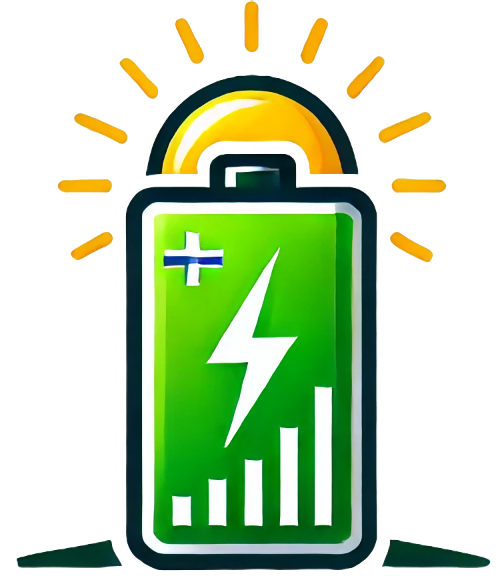
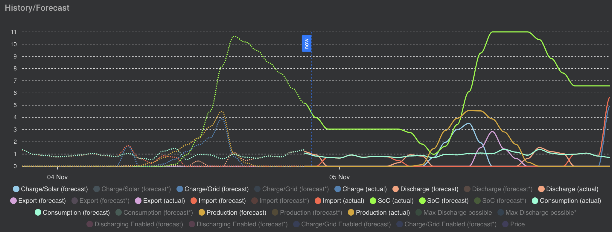

# WattWise 



WattWise is an AppDaemon application for [Home Assistant](https://www.home-assistant.io/)  that intelligently optimizes battery usage based on consumption forecasts, solar production forecasts, and dynamic energy prices. By leveraging historical data and real-time information, it schedules battery charging and discharging actions to minimize energy costs and maximize efficiency, providing seamless integration and real-time monitoring through Home Assistant's interface.

## Table of Contents 
 
- [Features](README.md#features)
 
- [How It Works](README.md#how-it-works)
 
- [Getting Started](README.md#getting-started)  
  - [Prerequisites](README.md#prerequisites)
 
  - [Installation](README.md#installation)
 
- [Configuration](README.md#configuration)  
  - [Home Assistant Setup](README.md#home-assistant-setup)
 
  - [AppDaemon Setup](README.md#appdaemon-setup)
 
  - [Customizing WattWise](README.md#customizing-wattwise)
 
- [Usage](README.md#usage)  
  - [Visualizing Forecasts](README.md#visualizing-forecasts)
 
- [Contributing]()
 
- [License](README.md#license)
 
- [Contact](README.md#contact)
 
- [Acknowledgements](README.md#acknowledgements)

## Features 
 
- **Hourly Optimization** : Executes the optimization process every hour to ensure decisions are based on the latest data.
 
- **Dynamic Forecasting** : Utilizes historical consumption data, solar production forecasts, and real-time energy prices.
 
- **Automated Charging & Discharging** : Schedules battery charging from the grid or solar and discharging to the house based on optimization results.
 
- **Real-Time Monitoring** : Updates Home Assistant sensors with current values and forecast data for comprehensive monitoring.
 
- **Customizable Parameters** : Adjust battery capacity, charge/discharge rates, tariffs, and more to fit your specific setup.
 
- **User-Friendly Visualization** : Integrates with [ApexCharts](https://github.com/RomRider/apexcharts-card)  for intuitive graphical representations of forecasts and actions.

## How It Works 

WattWise leverages linear programming to optimize the charging and discharging schedule of your home battery system. Here's a detailed explanation of the process:
 
1. **Data Collection** : 
  - **Consumption Forecast** : Calculates average consumption for each hour based on historical data from the past seven days.
 
  - **Solar Production Forecast** : Retrieves solar production forecasts for today and tomorrow from Home Assistant sensors.
 
  - **Energy Price Forecast** : Obtains current and future energy prices, considering both today's and tomorrow's rates.
 
2. **Optimization Algorithm** : 
  - **Objective** : Minimizes the total energy cost over a 24-hour horizon by determining the optimal times to charge (from solar or grid) and discharge the battery.
 
  - **Constraints** : 
    - **Battery Capacity** : Ensures the battery state of charge (SoC) stays within physical limits.
 
    - **Charge/Discharge Rates** : Respects maximum charge and discharge rates of the battery system.
 
    - **Energy Balance** : Maintains a balance between consumption, production, and battery/storage actions.
 
    - **Grid Interactions** : Manages energy import/export to/from the grid, considering feed-in tariffs.
 
3. **Scheduling Actions** : 
  - **Charging from Grid** : Schedules charging during periods of low energy prices or when solar production is insufficient.
 
  - **Discharging to House** : Schedules discharging during periods of high consumption or high energy prices.
 
  - **Updating States** : Adjusts Home Assistant sensors to reflect the optimized schedule and current statuses.
 
4. **Real-Time Updates** : 
  - **Sensor States** : Updates custom sensors with current values and forecasts, providing real-time insights.
 
  - **Visualization** : Enables graphical representations through ApexCharts for better understanding and monitoring.

## Getting Started 

### Prerequisites 
 
- **Home Assistant** : A running instance of [Home Assistant](https://www.home-assistant.io/).

- **HACS** : [Home Assistant Community Store](https://www.hacs.xyz/) installed

- **HA Solcast PV Solar Forecast Integration** : Installed via HACS and configured, so that you get an accurate PV production forecast.
The script expects the forecast information in the format provided by [Solcast](https://github.com/BJReplay/ha-solcast-solar).

- **Tibber Integration** : Installed and configured via the [official HA integration](https://www.home-assistant.io/integrations/tibber/). The script expects the price information in the format provided by Tibber.

 
- **AppDaemon** : 
  * Search for the “AppDaemon 4” add-on in the home assistant add-on store and install it.
  * Start the “AppDaemon 4” add-on
  * Check the logs of the “AppDaemon 4” add-on to see if everything went well.
  * [Relevant Forum Entry](https://community.home-assistant.io/t/home-assistant-community-add-on-appdaemon-4/163259)
  

### Installation 
 
1. **AppDaemon Python Packages** 
   
   Under Settings --> Add-Ons --> AppDaemon --> Configuration:
     * Add System Packages: `musl-dev`, `gcc`, `glpk`
     * Add Python Packages: `pulp`, `numpy==1.26.4`, `tzlocal`
 
2. **Set up WattWise in AppDaemon**  
  * Place `wattwise.py` (the WattWise script) is placed in your AppDaemon apps directory (e.g., `/root/addon_configs/a0d7b954_appdaemon/apps/`).
  You can do so e.g. via SSH or via the Visual Studio Code AddOns.

  * Register the app in `apps.yaml`in the same folder.
    * `ha_url`: The URL of your Home Assistant instance.
 
     * `token`: A long-lived access token from Home Assistant for API access.
        ```yaml
        wattwise:
          module: wattwise
          class: WattWise
          ha_url: http://homeassistant.local:8123
          token: "YOUR_LONG_LIVED_ACCESS_TOKEN"
        ```
1. **Configure Home Assistant Sensors**  
  * Place wattwise.yaml in your `/root/config/packages` folder.
  if the folder does not exist, create it.
  * Edit your configuration.yaml file of home assistant and add the packages statement (2nd line) in the homeassistant section of your configuration.yaml
    ```yaml
    homeassistant:
      packages: !include_dir_named packages
    ```
 
1. **Restart Services**  
  - **Home Assistant** : Restart to apply sensor configurations.
 
  - **AppDaemon** : Restart to load the WattWise application.

## Configuration 

Proper configuration is essential for WattWise to function correctly. Below are the key areas you need to configure.

### Customizing WattWise 
You can adjust various parameters within the `wattwise.py` script to match your specific setup: 

- **Battery Parameters** : 
  - `BATTERY_CAPACITY`: Total capacity of your battery in kWh.
 
  - `BATTERY_EFFICIENCY`: Efficiency factor of your battery (0 < efficiency ≤ 1).
 
  - `CHARGE_RATE_MAX`: Maximum charging rate in kW.
 
  - `DISCHARGE_RATE_MAX`: Maximum discharging rate in kW.
 
- **Time Horizon** : 
  - `TIME_HORIZON`: Number of hours to look ahead in the optimization (default is 24 hours).
 
- **Tariffs and Prices** : 
  - `FEED_IN_TARIFF`: Price for feeding energy back to the grid in ct/kWh.
 
- **Entity IDs** : 
  - Update the entity IDs in the script to match your Home Assistant sensors and switches. Key entities include: 
    - **Consumption Sensor** : Represents your house's energy consumption.
 
    - **Solar Forecast Sensors** : For today and tomorrow's solar production forecasts. Has to be in the format provided by Solcast.
 
    - **Price Forecast Sensor** : Contains the energy price forecast data. Has to be in the format provided by Tibber
 
    - **Battery State of Charge Sensor** : Indicates the current charge level of the battery.
 
    - **Battery Charger/Discharger Switches** : Controls for charging and discharging the battery.
    If you don't have any yet, you can create them as Home Assistant Helpers within Home Assistant.

**Note** : After making changes to the script, restart AppDaemon to apply the updates.
## Usage 

Once installed and configured, WattWise automatically runs the optimization process every hour. It analyzes consumption patterns, solar production forecasts, and energy prices to determine the most cost-effective charging and discharging schedule for your battery system.

### Visualizing Forecasts 
Integrate with [ApexCharts](https://github.com/RomRider/apexcharts-card)  in Home Assistant to visualize forecast data and optimized schedules.
You need additionally [lovelace-card-templater](https://github.com/gadgetchnnel/lovelace-card-templater) for the dynamic time horizons.

You find the YAML of the following card in the file ``wattwise-history-forecast-chart.yaml``



## Contributing 

Contributions are welcome! Whether it's reporting bugs, suggesting features, or submitting pull requests, your input helps improve WattWise.
 
1. **Fork the Repository**
 
2. **Create a Feature Branch** 

```bash
git checkout -b feature/YourFeature
```
 
3. **Commit Your Changes** 

```bash
git commit -m "Add Your Feature"
```
 
4. **Push to the Branch** 

```bash
git push origin feature/YourFeature
```
 
5. **Open a Pull Request**

Please ensure that your contributions adhere to the project's coding standards and include appropriate documentation.

## License 
This project is licensed under the [AGPL-3.0 license](https://www.gnu.org/licenses/agpl-3.0.html.en#license-text).

## Contact 
 
  
- **GitHub** : [bullitt168](https://github.com/bullitt168)

## Acknowledgements 
 
- [AppDaemon](https://appdaemon.readthedocs.io/en/latest/)
 
- [Home Assistant](https://www.home-assistant.io/)

- [SolCast](https://github.com/BJReplay/ha-solcast-solar)
  
- [ApexCharts Card](https://github.com/RomRider/apexcharts-card)
 

